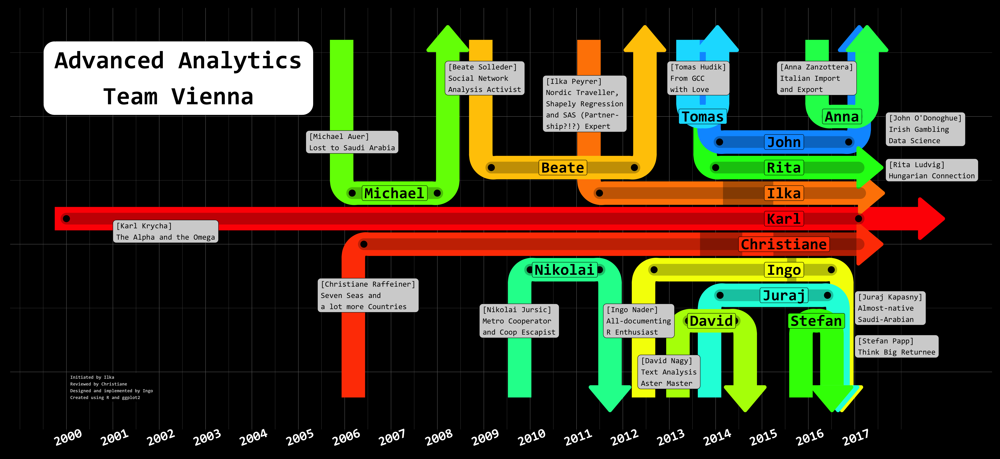

## Karl's Abschiedsgeschenk

R script that produces a plot of Karl's Advanced Analytics Team, to be offered to him as a present for him after his resignation.

The plot looks like this: 




Data is not included in the repo, as it contains personal data. It should be of the format

```R
dat <- tribble(
  ~first_name,    ~last_name,     ~start_date,  ~end_date,    ~label_pos_x, ~y_pos, ~textbox_x, ~textbox_y, ~color_ind, ~textbox_text_buildingblock,
  "Blossom",      "Powerpuff",   "2000-01-01", "2017-01-31", "2015-06-24",  6,     "2001-01-01",       5.5,  1,         "Leader in Pink", 
  "Buttercup",    "Powerpuff",   "2009-03-01", "2012-04-01", NA,            8,     "2008-03-01",      12.0,  4,         "Fighing Fury",
  "Bubbles",      "Powerpuff",        "2012-09-03", "2016-06-30", "2015-06-24",  4,     NA,                 2.5,  5,    "Unicorn Lover"  
)
dat_karenz <- tribble(
  ~start_date, ~end_date, ~y_pos, 
  "2014-02-28", "2015-03-31", 6, 
  "2015-07-18", "2015-09-29", 4 
)
```
